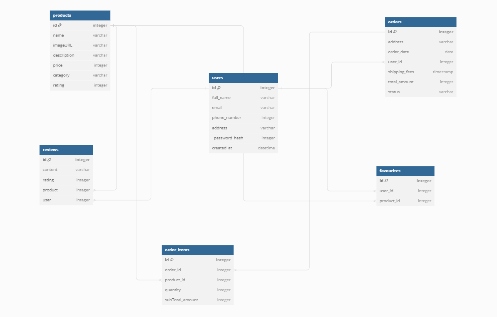

# e-commerce-backend

This is the backend implementation for an eCommerce application. It provides the necessary APIs and functionalities to support the frontend of an online store.

## Features

- User authentication (signup, login, logout)
- Product management (CRUD operations)
- Order processing
- Shopping cart functionality
- User profile management
- API documentation

## Tech Stack

- **Python**: Runtime for server-side development
- **Flask**: Web application framework for Python
- **MySQL**: SQL database for storing product and user information
- **Sqlite**: Object modeling for MySQL
- **JWT**: JSON Web Token for authentication
- **Swagger**: API documentation

## Getting Started

### Pre-requisites

- Python (version >= 3.10)
- SQLite
- Flask

### Installation

1. Clone the repository

   ```bash
   git clone https://github.com/Ombito/e-commerce-backend.git

2. Install dependencies
   
    ```bash
    cd ecommerce-backend
    pipenv shell
    pipenv install

3. Start the server
    ```bash
    cd app
    python3 app.py



## API Endpoints
Refer to [API.md](./API.md) for detailed documentation on available endpoints and request/response examples.


## Authentication
This project uses JSON Web Tokens (JWT) for authentication. When making requests to authenticated endpoints, include the token in the Authorization header.


## Contributing
Feel free to contribute to this project. Create a fork and submit a pull request with your changes.


## License
This project is licensed under the MIT License - see the [LICENSE]() file for details.


